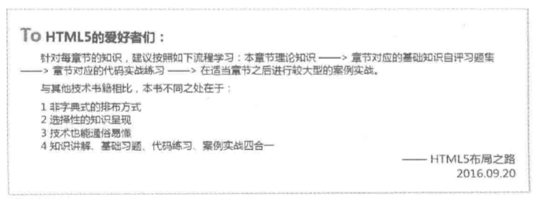
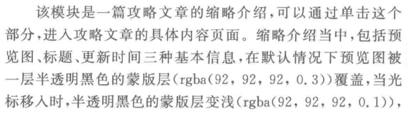

# html-css
学习web前段基础html和css

1. 浮动布局练习

>盒模型属性 浮动 清除浮动

功能需求：

实现：layout.html

2. 标签选择练习1

功能需求：

实现：list1.html

3. 标签选择练习2

功能需求：

实现：list2.html

4. 标签选择练习3

功能需求：

实现：list3.html

5. 文本样式处理

功能需求：

左上角收信人，右下角发信人，中间为正文；1像素实线#999颜色边框，边框与书信内容20像素空间

实现：letter.html

6. 定位布局

功能需求：

效果：

实现：position.html
